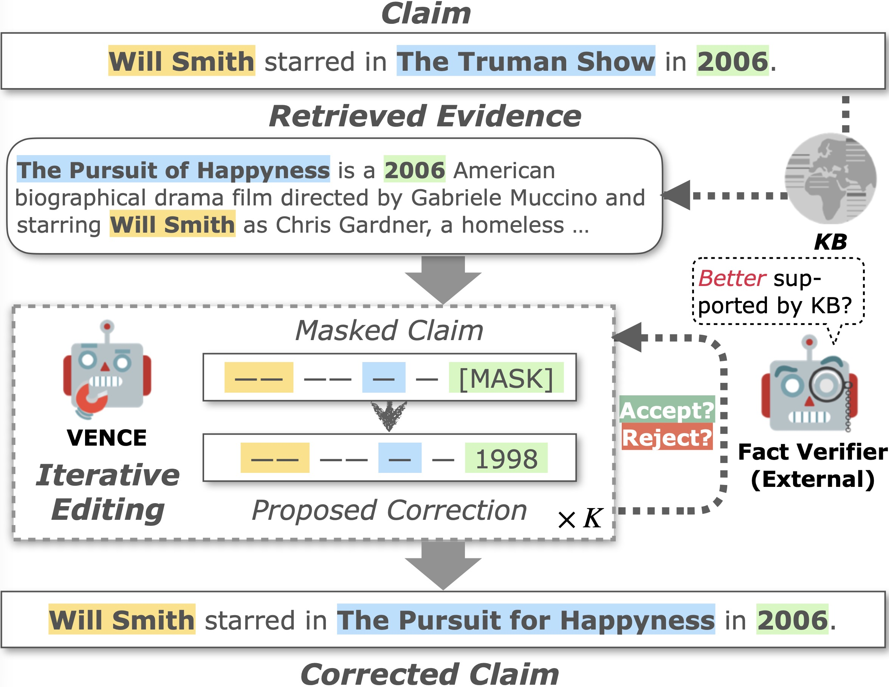

# VENCE

Code for our AAAI 2023 paper: [Converge to the Truth: Factual Error Correction via Iterative Constrained Editing](https://arxiv.org/abs/2211.12130).

## Dependencies
```shell
pip install -r requirements.txt
```
## Download dataset

The raw dataset can be downloaded from this [Google Drive folder](https://drive.google.com/drive/folders/1hzwg5NtVUB_cfXiADkSanCq0JjaQ87tV). This is the FEVER intermediate annotation data released by [Evidence-based Factual Error Correction](https://aclanthology.org/2021.acl-long.256/).

## Download processed data

The processed data can be downloaded from this [Google Drive folder](https://drive.google.com/drive/folders/1Hw3PeXZhlqHY5umbh_uscLu3RexBkeXt?usp=sharing). The data is organized as follows:
```shell
.
├── t5
│   └── data
│       ├── entity_loc.jsonl
│       ├── t5_data.json
│       ├── t5_test.json
│       ├── t5_train.json
│       └── t5_val.json
└── verfication
    └── data
        ├── test.json
        ├── train.json
        └── valid.json
```

### Data processing

Same as `verification/data_process.py`, the claim and evidence data for the proposal model should be processed as this:
1. Set `prefix` as `Please recover the part of the claim that was masked according to the evidence.`.
2. Organize the claim and evidence as `substituted entity : evidence : {evidence} claim : {claim}` or `substituted one word : evidence : {evidence} claim : {claim}`

## Download pre-trained checkpoints

Pre-trained checkpoints for T5 and verification models are stored [here](https://drive.google.com/drive/folders/1Hw3PeXZhlqHY5umbh_uscLu3RexBkeXt?usp=sharing).

Note that the verification model is off-the-shelf and could be replaced with other fact verification models.


## Training the T5 model
```shell
export PJ_HOME=YOUR_PATH_TO/VENCE/

python t5/finetune.py \
--model_name_or_path t5-base \
--do_train \
--do_eval \
--train_file $train_file \
--validation_file $valid_file \
--output_dir ${PJ_HOME}/t5/model \
--overwrite_output_dir \
--per_device_train_batch_size=4 \
--per_device_eval_batch_size=4 \
--predict_with_generate \
--text_column input \
--summary_column output
```


## Training the verfication model
```shell
export PJ_HOME=YOUR_PATH_TO/VENCE/

python verfication/finetune.py \
--model_name_or_path xlm-roberta-base \
--do_train \
--do_eval \
--train_file $train_file \
--validation_file $valid_file \
--per_device_train_batch_size=16 \
--per_device_eval_batch_size=8 \
--max_seq_length 512 \
--learning_rate 2e-5 \
--num_train_epochs 3 \
--output_dir ${PJ_HOME}/verfication/model \
--overwrite_output_dir 
```
## Running VENCE：
```shell
python main/main.py \
--iter_num 15 \
--es_lm 0.08 \
--es_ver 100 \
--es_dis 8
```
 
## Citation
If you find our work useful to your research, please kindly cite our paper (pre-print, official bibtex coming soon.):
```latex
@article{chen2022converge,
  title={Converge to the Truth: Factual Error Correction via Iterative Constrained Editing},
  author={Chen, Jiangjie and Xu, Rui and Zeng, Wenxuan and Sun, Changzhi and Li, Lei and Xiao, Yanghua},
  journal={arXiv preprint arXiv:2211.12130},
  year={2022}
}
```